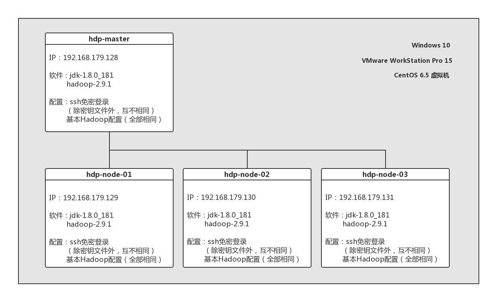

# Hadoop-conf

### 0 概述

本篇说明指引读者基于虚拟机Linux环境搭建简单Hadoop分布式集群。总览配置图如下所示。



### 1 准备工作

#### 1.1 需要准备的硬件

Windows计算机，配备至少6GB内存与100GB固态硬盘供虚拟机使用

测试机器配置：

ThinkPad E440 | Intel Core-i7 4712MQ CPU | 12GB |

128GB+256GB SSD, 500GB HDD | Windows 10 x64

#### 1.2 需要准备的软件

* VMWare WorkStation 15.0 Pro
* CentOS 6.5 x64 LiveDVD
> 用binDVD或其他版本安装也可


### 2 Hadoop环境搭建

#### 2.1 系统安装
首先安装虚拟机软件与虚拟机：
* 将虚拟机文件存放到固态硬盘
* 共创建4个，分别命名为hdp-master，hdp-node-01，hdp-node-02，hdp-node-03
* 每个虚拟机配置20GB硬盘空间与1.5GB内存，其他默认
* 每个虚拟机上安装VMTools以开启文本共享与文件拖动传输功能

对每个系统：

2.1.1 打开桌面上的Install to Hard Drive，用默认配置将系统文件安装到本地
> 其中确认选项选择Yes，且将主机名设置为对应结点名称，随后选择Write changes to disk
    
2.1.2 重启虚拟机，以root用户登录，做好用户相关配置，将Terminal放置在桌面上备用
> 可将root密码设置为000000，普通用户用户名和密码分别设置为hadoop和0000

#### 2.2 Hadoop基础环境安装

对每个系统：
##### 2.2.1 安装JDK 1.8并设置环境变量（若本机已有Java环境则跳过）

下载JDK包并传至虚拟机
https://www.oracle.com/technetwork/java/javase/downloads/jdk8-downloads-2133151.html
    
```
mkdir/usr/java

cd /usr/java                        # 此时将JDK包放置在此文件夹下

tar -zxvf jdk-8u181-linux-x64.tar.gz

vi /etc/profile                     # 添加环境变量

 +  # set java environment
 +  JAVA_HOME=/usr/java/jdk1.8.0_181
 +  JRE_HOME=/usr/java/jdk1.8.0_181/jre
 +  CLASS_PATH=.:$JAVA_HOME/lib/dt.jar:$JAVA_HOME/lib/tools.jar:$JRE_HOME/lib
 +  PATH=$PATH:$JAVA_HOME/bin:$JRE_HOME/bin
 +  export JAVA_HOME JRE_HOME CLASS_PATH PATH
    
source /etc/profile

alternatives --install /usr/bin/java java /usr/java/jdk1.8.0_181/bin/java 300

alternatives --config java          # 选择刚才安装的版本

java -version                       # 验证JDK是否安装成功

```

##### 2.2.2 安装并配置SSH（已安装，跳过安装步骤）

```

rpm -qa | grep ssh                  # 验证SSH是否安装

ssh localhost                       # 验证SSH正常工作
                                    # 若出现connection refused则启动或重启SSH服务
                                    # service sshd start 或 service sshd restart
              
chkconfig --list sshd               # 查看ssh开机启动配置

chkconfig sshd on                   # 设置ssh开机启动，防止出现connection refused情况

cd ~/.ssh

ssh-keygen -t rsa                   # 生成密钥以配置免密登录

cat id_rsa.pub >> authorized_keys   # 加入授权

chmod 600 ./authorized_keys

ssh localhost                       # 验证免密登录

```

##### 2.2.3 安装Hadoop并配置

下载Hadoop安装包并传至虚拟机
http://mirror.bit.edu.cn/apache/hadoop/common/stable/hadoop-2.9.1.tar.gz

###### 2.2.3.1 创建hadoop用户并建立HDFS文件夹（若前面没有新建则用如下方法）

```
useradd -m hadoop -G root -s /bin/bash

passwd hadoop                       # 输入两次指定密码，可用0000

visudo                              # 修改hadoop用户的sudo权限

    ## Allow root to run any commands anywhere
    root   ALL=(ALL) ALL
 +  hadoop ALL=(ALL) ALL

cd /home/hadoop

mkdir dfs                           # 创建HDFS文件夹

cd dfs

mkdir name

mkdir data

mkdir tmp

```

###### 2.2.3.2 安装Hadoop

```
tar -zxvf hadoop-2.9.1.tar.gz

mv ./hadoop-2.9.1 /usr/local/hadoop

chown -R hadoop:hadoop /usr/local/hadoop
                                    # 修改文件权限

vi /etc/profile                     # 添加环境变量

 +  # set hadoop environment
 +  HADOOP_HOME=/usr/local/hadoop
 +  HADOOP_CONFIG_DIR=/usr/local/hadoop/etc/hadoop
 +  PATH=$PATH:$HADOOP_HOME/bin
 +  export HADOOP_HOME PATH

source /etc/profile

hadoop version                      # 验证Hadoop安装是否成功

```

###### 2.2.3.3 配置Hadoop

> 注意：所有主机的Hadoop配置必须相同，建议先配置hdp-master，然后将配置好的`$HADOOP_HOME/etc/hadoop`文件夹复制到其他虚拟机的相同位置（覆盖原文件）。

```

cd $HADOOP_CONFIG_DIR

vi hadoop-env.sh

 -  export JAVA_HOME={JAVA_HOME}
 +  export JAVA_HOME=/usr/java/jdk1.8.0_181
                                    # 修改Java环境变量为之前配置的JDK路径
                                    
vi core-site.xml

    <configuration>
 +  	<property>
 +  		<name>fs.defaultFS</name>
 +  		<value>hdfs://hdp-master:9000</value>
 +  	</property>
 +  
 +  	<property>
 +  		<name>hadoop.tmp.dir</name>
 +  		<value>/home/hadoop/dfs/tmp</value>
 +  	</property>
    </configuration>
    
vi hdfs-site.xml

    <configuration>
 +      <property>
 +          <name>dfs.namenode.name.dir</name>
 +          <value>/home/hadoop/dfs/name</value>
 +      </property>
 +  
 +      <property>
 +          <name>dfs.datanode.data.dir</name>
 +          <value>/home/hadoop/dfs/data</value>
 +      </property>
 +  
 +      <property>
 +          <name>dfs.replication</name>
 +          <value>3</value>
 +      </property>
 +  
 +      <property>
 +          <name>dfs.secondary.http.address</name>
 +          <value>hdp-master:50090</value>
 +      </property>
    </configuration>
    
vi mapred-site.xml                  # 若无此文件则从模板文件新建   
                                    # cp mapred-site.xml.template mapred-site.xml

    <configuration>
 +      <property>
 +          <name>mapreduce.framework.name</name>
 +          <value>yarn</value>
 +      </property>
    </configuration>

vi yarn-site.xml

    <configuration>
    
    <!-- Site specific YARN configuration properties -->
 +      <property>
 +          <name>yarn.resourcemanager.hostname</name>
 +          <value>hdp-master</value>
 +      </property>
 +  
 +      <property>
 +          <name>yarn.nodemanager.aux-services</name>
 +          <value>mapreduce_shuffle</value>
 +      </property>
    </configuration>

vi slaves

 +  hdp-node-01
 +  hdp-node-02
 +  hdp-node-03

```

#### 2.3 结点互连配置

##### 2.3.1 查看静态IP（虚拟机中不必特别配置静态IP）

对每个结点：

```
ifconfig                            # 查看本机IP

vi /etc/hosts                       # 根据结点实际IP修改hosts配置文件，测试机器各IP如下

 +  hdp-master    192.168.179.128
 +  hdp-node-01   192.168.179.129
 +  hdp-node-02   192.168.179.130
 +  hdp-node-03   192.168.179.131

ping hdp-node-01                    # 测试网络互通

```

##### 2.3.2 配置结点间ssh免密登录

> 注意：由于之前一直是在root用户下操作，故ssh配置也在root用户下完成，若需要用hadoop用户操作请切换该用户并用sudo命令完成下列操作。

对除hdp-master外的每个结点：

```

ssh-copy-id hdp-master              # 将本机的ssh密钥传给主结点

ssh hdp-master                      # 测试到主结点的免密登录

exit                                # 断开ssh连接

```

对hdp-master结点：

```

cd ~/.ssh

cat authorized_keys                  # 查看密钥

scp authorized_keys hdp-node-01:~/.ssh/
scp authorized_keys hdp-node-02:~/.ssh/
scp authorized_keys hdp-node-03:~/.ssh/
                                     # 将完整的密钥文件传给各子结点

ssh hdp-node-02                      # 测试网络互通

```

### 3 启动与测试Hadoop集群

对hdp-master结点：

```

cd $HADOOP_HOME

hadoop namenode -format             # HDFS初始化

sbin/start-dfs.sh                   # 启动HDFS

sbin/start-yarn.sh                  # 启动YARN

jps                                 # 查看Java虚拟机进程，验证Hadoop是否启动成功

sbin/stop-all.sh                    # 停止所有Hadoop进程（若需要）

```

> 若启动成功，则jps命令返回结果如下：


|结点名称|hdp-master|hdp-node-01|hdp-node-02|hdp-node-03|
|---|---|---|---|---|
|包含进程名|`NameNode` `SecondaryNameNode` `ResourceManager`|`DataNode` `NodeManager`|`DataNode` `NodeManager`|`DataNode` `NodeManager`|

